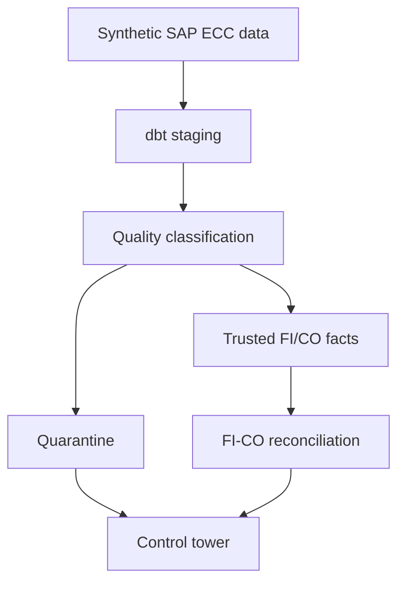

# SAP Data Modernization Control Tower

A portfolio-grade data engineering project that modernizes synthetic SAP ECC
FI/CO data into a trusted analytical model. The project detects bad source
records, quarantines them, reconciles FI with CO, and publishes an operational
control-tower dashboard.

The default execution mode uses DuckDB, so the complete pipeline can run in a
GitHub Codespace or GitHub Actions without a paid data platform.

## What this demonstrates

- Deterministic generation of SAP-style `BKPF`, `BSEG`, `COBK`, and `COEP` data
- Duplicate, orphan, missing-exchange-rate, and unbalanced-document detection
- Quarantine-before-publication data quality design
- FI document balancing and FI-to-CO financial reconciliation
- Layered dbt models with automated tests
- Airflow orchestration design
- GitHub Actions CI and GitHub Pages dashboard publication
- A clean migration path from DuckDB to Snowflake

## Architecture



## Quick start

### GitHub Codespaces

1. Open the repository in a Codespace.
2. Run:

```bash
make pipeline
```

3. Open `site/index.html` to view the generated control tower.

### Local execution

Python 3.11 or newer is required.

```bash
python -m venv .venv
source .venv/bin/activate  # Windows: .venv\Scripts\activate
pip install -r requirements.txt
make pipeline
```

The pipeline is deterministic. Change the scale with:

```bash
python scripts/run_pipeline.py --documents 1000
```

## Deliberate failure scenarios

The generator injects controlled defects so the project demonstrates failure
handling instead of merely processing perfect input:

| Scenario | Expected treatment |
| --- | --- |
| Duplicate `BSEG` business key | Duplicate row quarantined |
| `BSEG` row without `BKPF` header | Orphan row quarantined |
| FI document out of balance | Entire document quarantined |
| Currency without a valid exchange rate | Affected rows quarantined |
| FI expense not equal to CO primary cost | Published as reconciliation exception |

## Repository structure

```text
airflow/dags/       Airflow orchestration definition
dbt/models/         Staging, quality, fact, and reporting models
dbt/seeds/          Generated synthetic SAP extracts
dbt/tests/          Business-control tests
docs/               Architecture and migration notes
profiles/           DuckDB dbt profile
scripts/            Data generation and dashboard build
site/               Generated static control tower
```

## Snowflake deployment

DuckDB is the executable demonstration platform. The dbt model boundaries and
SQL are intentionally portable. A later milestone will add a Snowflake target,
incremental ingestion, account-usage cost attribution, RBAC, and masking.

All data in this repository is synthetic. It contains no employer data or SAP
proprietary extracts.
